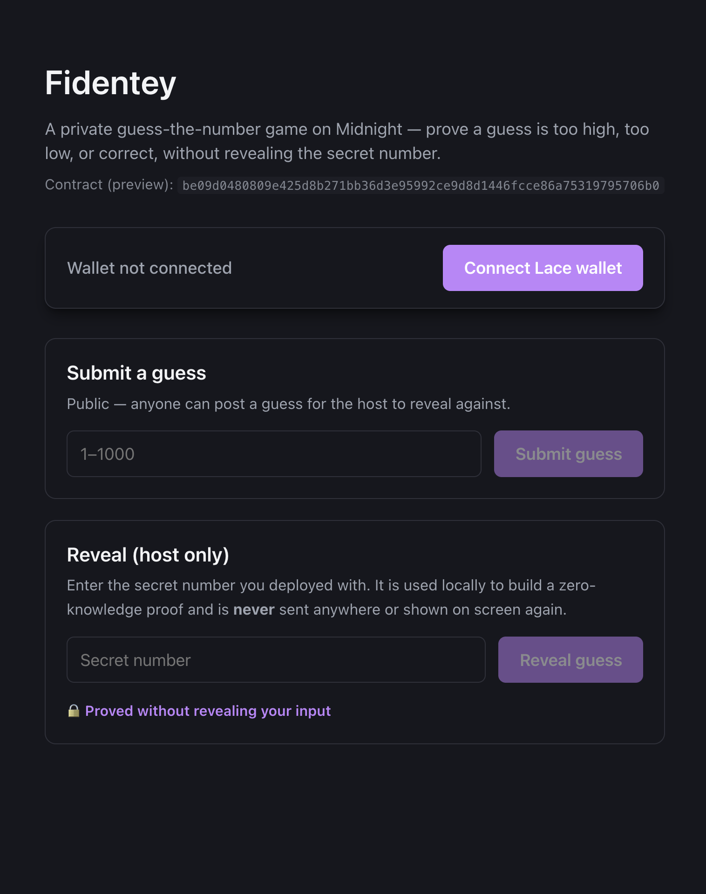
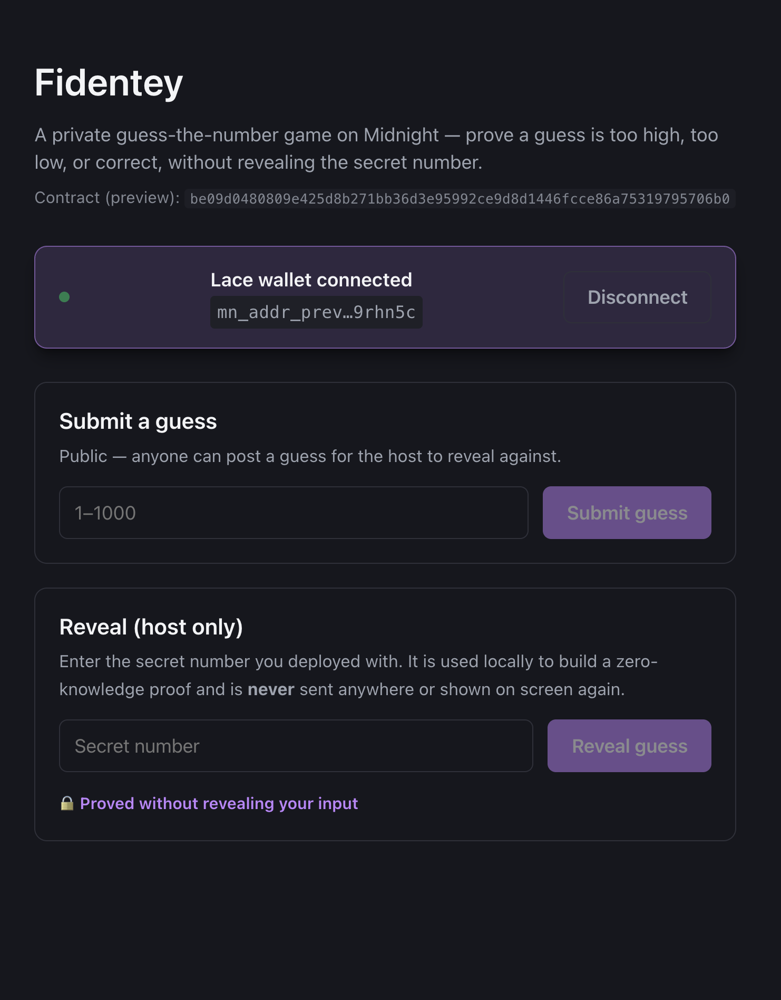

# Fidentey

> A private guess-the-number game on Midnight — prove a guess is too high, too low, or correct without ever revealing the secret number.

## Demo Video

https://www.loom.com/share/c83cbfa7ec054bd68427847c7cb6db8f

## Live Demo

https://fidentey-one.vercel.app/

Note: wallet connect/disconnect works for any visitor. Actually submitting a guess or reveal additionally requires Lace's proving step, which currently delegates to a **local proof server on your own machine** (`localhost:6300`) rather than proving purely in-browser — see Prerequisites below if you want to try a real circuit call yourself, not just connect a wallet.

## Contract Address

| Network  | Address                                                             |
|----------|----------------------------------------------------------------------|
| Preview  | `be09d0480809e425d8b271bb36d3e95992ce9d8d1446fcce86a75319795706b0`   |

The frontend (`web/`) is wired to the **Preview** deployment above.

## What This Does

The host commits to a secret number (1–1000) when the contract is deployed. From then on, any player can submit a guess. Only the host — the one person who actually knows the number — can reveal the result of a pending guess, and that reveal discloses nothing except "too low," "too high," or "correct." The secret number itself is never written to the chain until a guess actually wins, at which point revealing it is the deliberate, natural conclusion of the game.

Under the hood: at deploy time the host discloses only a one-way hash commitment to the number (`secretHash`). Each round, a player calls `submitGuess()` to post their guess publicly. The host then calls `revealGuess()`, supplying the real number as a private witness; the circuit re-hashes it, checks it against the stored commitment (proving the host isn't lying about which number they committed to), compares it against the pending guess entirely inside the zero-knowledge proof, and discloses only the three-way outcome. If the guess is correct, the circuit also discloses the number itself and marks the game solved.

## Privacy Model

- **What is PUBLIC (on-chain, visible to anyone):**
  - `secretHash` — a 32-byte hash commitment to the secret number (never the number itself, until a win)
  - `pendingGuess` — the most recently submitted guess
  - `attempts` — how many guesses have been submitted
  - `solved` — whether the game has been won
  - `lastResult` — the outcome of the last reveal (too low / too high / correct)
  - `revealedNumber` — the secret number, populated only once the game is solved

- **What is PRIVATE (private witness, never on-chain):**
  - `hostSecretNumber` — the raw secret number, supplied off-chain by the host as a witness. It exists only inside the host's local proof computation and is never written to the ledger, a transaction, or any log while the game is open.

- **What the user PROVES without revealing:**
  - Calling `revealGuess()` proves "I know the number whose hash equals the commitment stored on-chain, and here is how it compares to the pending guess" — without revealing the number, unless the guess is correct, in which case revealing it is the deliberate point of winning.

## Privacy Claim

An on-chain observer (or anyone reading the indexer) sees: the `secretHash` commitment, every `pendingGuess` ever submitted, the `attempts` counter, whether the game is `solved`, and the outcome of each reveal (too low / too high / correct). They **cannot** see the host's actual secret number at any point before a winning guess — not in the ledger, not in a transaction, not in a log, not even in the proof itself (the reveal circuit only discloses the three-way comparison result). The number is witnessed entirely off-chain by the host's own wallet and only touches the chain, in the clear, at the deliberate moment someone wins.

## Tech Stack

- Midnight network (Preview testnet)
- Compact language (`compact` compiler v0.5.1, `language_version >= 0.23`)
- Midnight.js SDK (`@midnight-ntwrk/midnight-js-contracts`, DApp Connector API) for the browser frontend
- React + Vite (`web/`)
- Lace wallet (browser extension)
- Node.js v22+
- Docker (for the local proof server, contract deploy only)
- TypeScript, Vitest

## Prerequisites

- [Node.js](https://nodejs.org/) v22 or later
- [Lace wallet](https://www.lace.io/) browser extension, connected to the Midnight Preview network, for the frontend
- [Docker](https://www.docker.com/) (running, for the proof server) — needed both to redeploy the contract **and** to actually submit a circuit call from the frontend. Lace's proving delegates the real computation to this local proof server rather than doing it purely in-browser; without it running, circuit calls fail with `POST http://localhost:6300/check net::ERR_CONNECTION_REFUSED`.
- The Compact compiler (`compact --version` should print a version number) — only needed to recompile the contract

## Setup

```bash
# Clone and install
git clone <this-repo-url>
cd fidentey
npm install

# Start the local proof server (needed for deploying — not for compile/test)
#
# Use midnightntwrk/proof-server (no "e"), not midnightnetwork/proof-server:
# the latter is a stale image built against an older ledger version than the
# current SDK expects. It doesn't error on a mismatch — it silently accepts
# every /prove request and spins at 100% CPU forever without responding,
# which looks exactly like a hung/slow proof until you check its memory
# usage (flat, because it isn't actually doing anything).
docker pull midnightntwrk/proof-server:8.1.0
docker run -d --name midnight-proof-server -p 6300:6300 midnightntwrk/proof-server:8.1.0
# First run downloads ~25MB of proving/verifying keys before it's ready —
# wait for `curl http://localhost:6300` to return 200 before deploying.

# Compile the contract
npm run compile

# Deploy to the Preview testnet
npm run deploy
# — prints a wallet address; fund it at the Preview faucet, then the
#   script continues automatically once funds arrive.

# Check your wallet / network state at any time
npm run check-balance
npm run network
```

## Run Locally (Frontend)

The frontend lives in `web/` and talks directly to the already-deployed Preview contract above — you don't need the Compact compiler to run it, but you **do** need the local proof server running (see Prerequisites) to actually submit a guess or reveal.

```bash
# Start the local proof server first — see the Setup section below for the
# full docker run command. Circuit calls fail with ERR_CONNECTION_REFUSED
# on localhost:6300 without it.

git clone <this-repo-url>
cd fidentey/web
npm install
npm run dev
# open http://localhost:5173, then connect the Lace wallet (set to Preview network)
```

To build the static site for deployment:

```bash
cd web
npm run build   # outputs to web/dist
```

## Run Tests

```bash
npm test
```

Covers: circuit logic (deterministic deploy, rejecting a reveal from someone who doesn't know the number), state transitions (too low → too high → correct across guesses, rejecting further guesses once solved), and that private inputs are never exposed (the raw secret number never appears anywhere in the public ledger state before a win).

## Initial Idea

_[LEAVE PLACEHOLDER — to be filled in manually]_

## Screenshots

**Before connecting:**



**After connecting Lace:**


